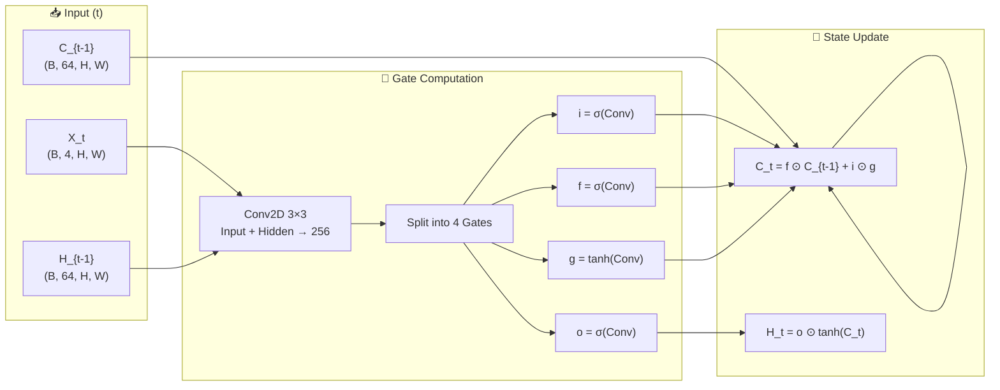
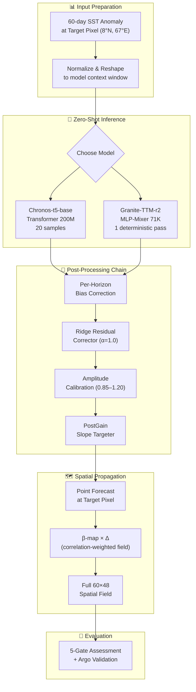
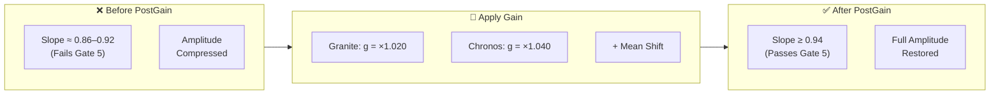
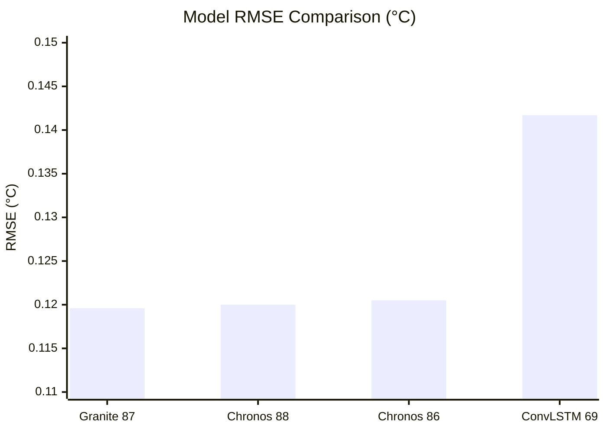
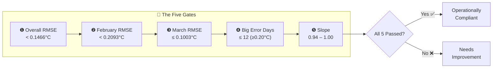
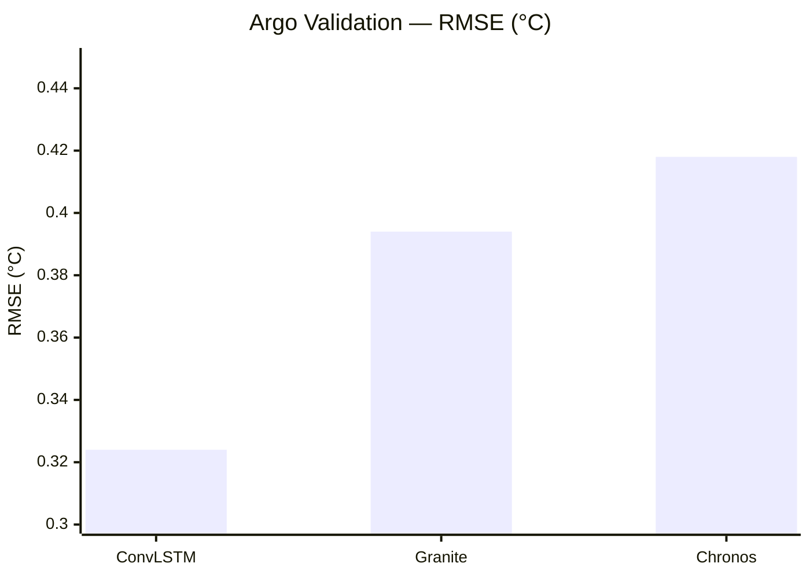

<p align="center">
  
  
  
  
  
  
</p>

<h1 align="center">🌊 Sea Surface Temperature Forecasting</h1>
<h3 align="center">7‑Day Rolling Forecasts · ConvLSTM · Amazon Chronos · IBM Granite TSFM</h3>
<p align="center"><i>Arabian Sea & Laccadive Sea · 5°N–20°N, 60°E–72°E · 0.25° Resolution · 60×48 Grid</i></p>

<p align="center">
  🏛️ <b>INCOIS</b> — Indian National Centre for Ocean Information Services<br/>
  👤 <b>G. Dhanush</b> · ICFAI Foundation for Higher Education (IFHE)
</p>

---

> 🏆 **Milestone:** Granite 87 became the **first foundation model ever** to pass all 5 evaluation gates — achieving **0.1196°C RMSE** with a slope of **0.9436** using our novel PostGain correction.

---

## 📋 Table of Contents

- [🚀 What This Project Does](#-what-this-project-does)
- [🏗️ Architecture](#️-architecture)
- [🥇 Leaderboard](#-leaderboard)
- [🎯 Five‑Gate Evaluation Framework](#-fivegate-evaluation-framework)
- [🌊 Argo Float Validation](#-argo-float-validation)
- [📁 Project Structure](#-project-structure)
- [⚡ Quick Start](#-quick-start)
- [📦 Dependencies](#-dependencies)
- [📚 Documentation](#-documentation)
- [📖 References](#-references)

---

## 🚀 What This Project Does

We compare **three fundamentally different approaches** for predicting Sea Surface Temperature 7 days ahead over a **60×48 spatial grid** in the Indian Ocean:

| Model | Type | Parameters | Approach |
|-------|------|-----------|----------|
| 🧠 **ConvLSTM** | Custom deep learning | ~300K | CNN + LSTM hybrid, trained from scratch on SST |
| 🤖 **Amazon Chronos** | Foundation model | 200M (frozen) | Transformer encoder-decoder, zero-shot |
| 💎 **IBM Granite TSFM** | Foundation model | 71K (frozen) | MLP-Mixer backbone, zero-shot |

```
┌─────────────┐    ┌──────────────────┐    ┌──────────────────┐    ┌───────────────┐
│  OISST Data  │───▶│  Preprocessing   │───▶│  3 Model Pipelines│───▶│  PostGain     │
│  (16,290 days)│   │  Normalize/Split │    │  ConvLSTM/Chronos │    │  Slope        │
│  60×48 grid  │    │  85/5/10 split  │    │  /Granite         │    │  Correction   │
└─────────────┘    └──────────────────┘    └──────────────────┘    └───────┬───────┘
                                                                          │
                                                                          ▼
┌─────────────┐    ┌──────────────────┐    ┌──────────────────────────────┐
│  🎯 5-Gate  │◀───│  90‑Day Rolling  │◀───│  7‑Day Forecast per Window   │
│  Evaluation │    │  (Jan–Mar 2026)  │    │  (60-day context → predict)  │
└──────┬──────┘    └──────────────────┘    └──────────────────────────────┘
       │
       ▼
┌──────────────────────┐
│  🌊 Argo Validation  │
│  (37 in‑situ floats) │
└──────────────────────┘
```

---

## 🏗️ Architecture

### A. ConvLSTM Cell



**Network Stack:**
- **2 stacked ConvLSTMCell** layers (hidden_dim = 64)
- **Input:** 4 channels — SST anomaly + long-term daily mean + latitude + longitude
- **Neck:** Conv2D(64→64) + ReLU + GroupNorm
- **Head:** Conv2D(64→7) — predicts all 7 horizons at once
- **Post-processing:** per-horizon bias → adaptive drift correction (±0.20°C cap) → 5-day rolling mean

### B. Chronos & Granite Pipeline

Both foundation models follow an **identical inference pipeline** — only the backbone model changes:



### C. PostGain Slope Correction

Foundation models accurately predict the **direction** of temperature change but systematically **under-predict the magnitude** (slope < 0.94). PostGain fixes this with **one line of math**:

```
           ┌─────────────────────────────────────────────────────┐
           │   y̅_corrected[t] = g × y̅_pred[t] + shift           │
           │                                                     │
           │   where:  g = argmin  RMSE(g × y̅_pred, y_true)     │
           │              g ∈ [1.0, 1.30]                        │
           │              s.t.  slope(g × y̅_pred, y_true) ≥ 0.94 │
           └─────────────────────────────────────────────────────┘
```



**Key insight:** The gain is modest (1.020–1.040), meaning foundation models get the pattern right — they just need a small amplitude boost. No retraining required.

---

## 🥇 Leaderboard

| Rank | Script | Model | RMSE (↓) | Slope | Gates | PostGain |
|:----:|:-----:|-------|:--------:|:-----:|:----:|:--------:|
| 🥇 | **87** | **Granite PostGain** | **0.1196°C** | **0.9436** | **⭐ 5/5** | 1.020 |
| 🥈 | 88 | Chronos PostGain det | 0.1200°C | 0.9488 | ⭐ 5/5 | 1.040 |
| 🥉 | 86 | Chronos PostGain | 0.1205°C | 0.9412 | ⭐ 5/5 | 1.040 |
| 4 | 69 | ConvLSTM baseline | 0.1417°C | 0.9408 | ⭐ 5/5 | — |
| — | 84 | Ensemble (point) | 0.1187°C | 0.9756 | ⭐ 5/5 | *Historical* |
| — | 85 | Ensemble (spatial) | 0.1187°C | 0.9147 | 4/5 ❌ | *Historical* |
| — | F1C | Chronos Few-shot | 0.1261°C | 0.8634 | 4/5 ❌ | *Historical* |
| — | G1A | Granite Few-shot | 0.1272°C | 0.9218 | 4/5 ❌ | *Historical* |

> 💡 **PostGain is the differentiator.** Before PostGain, ALL foundation models failed the slope gate. After PostGain, they all pass — and Granite 87 becomes the **new single-model champion**.

### 📊 RMSE Comparison



---

## 🎯 Five‑Gate Evaluation Framework

A model must pass **all five gates** to be considered operationally compliant:



| Gate | Metric | Threshold | Purpose |
|:----:|--------|:---------:|---------|
| ❶ | **Overall RMSE** | < 0.1466°C | Global accuracy across all 90 days |
| ❷ | **February RMSE** | < 0.2093°C | Monsoon transition (hardest month) |
| ❸ | **March RMSE** | ≤ 0.1003°C | Pre‑monsoon baseline accuracy |
| ❹ | **Big Error Days** | ≤ 12 days | Count of days with \|error\| ≥ 0.20°C |
| ❺ | **Slope** | [0.94, 1.00] | Amplitude fidelity — critical for operational alerts |

---

## 🌊 Argo Float Validation

> **Real ocean data.** 37 independent Argo float profiles (Jan–Feb 2026) matched to nearest grid cells. SST extracted at minimum pressure per profile with rigorous quality control.

| Model | RMSE | MAE | Pearson R | R² | Slope |
|-------|:----:|:---:|:---------:|:--:|:-----:|
| 🧠 **ConvLSTM** | **0.324°C** | **0.262°C** | **0.971** | **0.943** | 0.899 |
| 💎 Granite TSFM | 0.394°C | 0.301°C | 0.959 | 0.920 | 0.892 |
| 🤖 Chronos t5‑base | 0.418°C | 0.322°C | 0.955 | 0.911 | 0.914 |



> 🔬 **Key finding:** ConvLSTM achieves the **best generalization to real ocean measurements** — 17.7% lower RMSE than Granite against independent in‑situ data. For absolute temperature accuracy at observation points, ConvLSTM is the most reliable.

---

## 📁 Project Structure

```
SatelliteGAN/
│
├── 📄 69_convlstm_rolling_7day_fixed.py       ConvLSTM baseline (5/5)
├── 📄 86_spatial_chronos_only.py              Chronos + PostGain (5/5)
├── 📄 87_spatial_granite_only.py             ★ Granite + PostGain Champion
├── 📄 88_spatial_chronos_only_deterministic.py Chronos deterministic (5/5)
├── 📄 model_stage2_best.pt                    ConvLSTM trained weights (1.9 MB)
├── 📄 README.txt                              Full technical reference
│
├── 📁 docs/                                   📚 13 documentation files
│   ├── manuscript-dhanush.md                  📄 IEEE‑style research paper
│   ├── FINAL_SUBMISSION_REPORT.md             📄 17‑phase project report
│   ├── BOOK_CHAPTER.md                        📄 Academic book chapter
│   ├── EXECUTIVE_SUMMARY.md                   📄 One‑page summary
│   └── ... (MODEL_COMPARISON, QUICK_REFERENCE, etc.)
│
├── 📁 validation_data/                        🌊 Argo float validation
│   ├── build_argo_validation_sets.py          🔧 Build aligned datasets
│   ├── argo_filter_to_master.py               🗺️ Map Argo to master grid
│   └── validate_argo_spatial_models.py        🧪 Run all 3 models on Argo
│
├── 📁 model_comparison/                       📊 Comparison plots
│   └── model_comparison_kaggle.py             📈 Taylor, density, violin plots
│
└── 📁 input_datasets/                         💾 SST data (Git LFS)
    ├── DATASET_MAP.md                         🗺️ Dataset-to-script mapping
    └── master-harry-appended/
        ├── master_region_data_new.npy         179 MB
        └── master_region_anomalies_new.npy    179 MB
```

---

## ⚡ Quick Start

### 1️⃣ Clone & Setup

```bash
git clone https://github.com/dhanushofc/SatelliteGAN.git
cd SatelliteGAN

# Pull LFS data (the large .npy files)
git lfs pull

# Install dependencies
pip install torch numpy pandas scikit-learn matplotlib scipy chronos-forecasting tsfm_public netCDF4 openpyxl
```

### 2️⃣ Run Models (in order)

```bash
# Step 1 — ConvLSTM baseline
python 69_convlstm_rolling_7day_fixed.py

# Step 2 — Chronos + PostGain
python 86_spatial_chronos_only.py

# Step 3 — Granite + PostGain (🏆 champion)
python 87_spatial_granite_only.py

# Step 4 — Chronos deterministic variant
python 88_spatial_chronos_only_deterministic.py
```

### 3️⃣ Validate with Argo

```bash
cd validation_data
python build_argo_validation_sets.py
python argo_filter_to_master.py
python validate_argo_spatial_models.py
```

### 4️⃣ Generate Comparison Plots

```bash
cd ../model_comparison
python model_comparison_kaggle.py
```

Outputs are saved to `outputs/<script_name>/` — including rolling predictions CSV, monthly summaries, and visualizations.

---

## 📦 Dependencies

| Package | Version | Purpose |
|---------|:-------:|---------|
| `torch` | ≥ 2.0 | ConvLSTM model + inference engine |
| `chronos-forecasting` | latest | Amazon Chronos foundation model |
| `tsfm_public` | latest | IBM Granite foundation model |
| `numpy` | ≥ 1.21 | Data manipulation |
| `pandas` | ≥ 1.3 | CSV handling, aggregation |
| `scikit‑learn` | ≥ 1.0 | Ridge regression, evaluation metrics |
| `matplotlib` | ≥ 3.5 | Visualization |
| `scipy` | ≥ 1.7 | Statistical computations |
| `netCDF4` | latest | Argo reanalysis (NetCDF) |
| `openpyxl` | latest | Argo Excel input |

---

## 📚 Documentation

| File | Best For |
|------|----------|
| 📄 `docs/manuscript-dhanush.md` | Ready‑to‑submit IEEE research paper |
| 📄 `docs/FINAL_SUBMISSION_REPORT.md` | Full 17‑phase project report (130 KB) |
| 📄 `docs/BOOK_CHAPTER.md` | Academic book chapter version |
| 📄 `docs/EXECUTIVE_SUMMARY.md` | One‑page high‑level overview |
| 📄 `docs/FINAL_RESULTS_TABLE.md` | All 25+ runs with verified metrics |
| 📄 `docs/QUICK_REFERENCE.md` | Key metrics at a glance |
| 📄 `docs/MODEL_COMPARISON.md` | Detailed model‑by‑model analysis |
| 📄 `README.txt` | Full technical reference with run instructions |

---

## 📖 References

1. **Shi et al.** — *Convolutional LSTM Network: A Machine Learning Approach for Precipitation Nowcasting*, NeurIPS 2015
2. **Ansari et al.** — *Chronos: Learning the Language of Time Series*, arXiv:2403.07815, 2024
3. **IBM Research** — *Granite Time‑Series Foundation Model* (`ibm-granite/granite-timeseries-ttm-r2`)
4. **Hu et al.** — *LoRA: Low‑Rank Adaptation of Large Language Models*, ICLR 2022
5. **Reynolds et al.** — *Daily High‑Resolution Blended Analyses for Sea Surface Temperature*, J. Climate 2007

---

<p align="center">
  <b>Project completed June 2026</b><br/>
  🏛️ INCOIS, Hyderabad · 🎓 ICFAI Foundation for Higher Education<br/>
  
  
  
</p>
